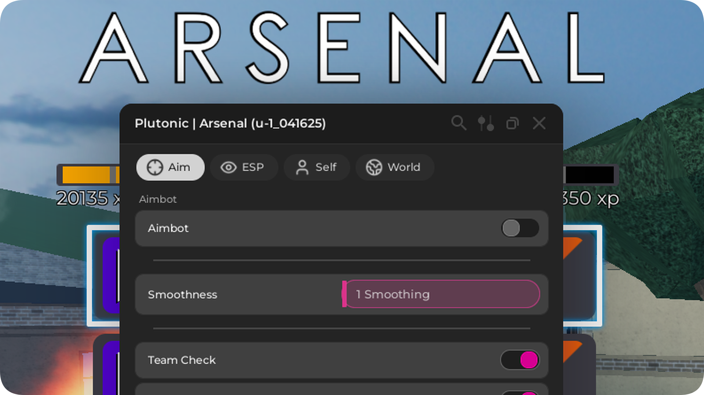

# $\textcolor{red}{\textsf{Plutonic}}$
A repository hosting the Plutonic Client.

<p align="center"></p>

## What is $\textcolor{red}{\textsf{Plutonic}}$?
Plutonic is a client that (is soon to) support multiple games.

### Current Games Supported
✅ Arsenal

## Loadstring
```lua
loadstring(game:HttpGet("https://raw.githubusercontent.com/OpposedDev/Plutonic/refs/heads/main/source/loader.lua"))()
```
